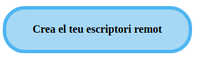
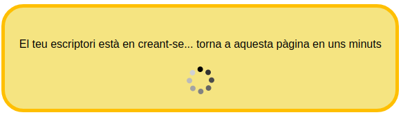
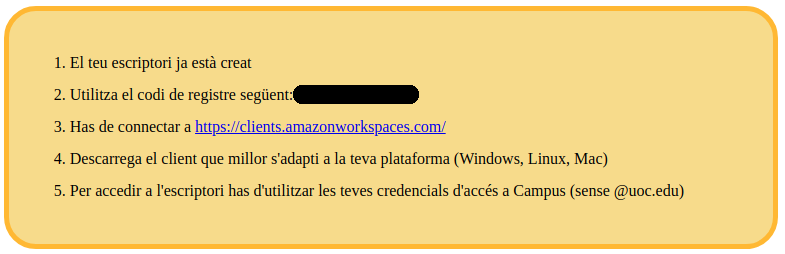

# VDI autoaprovisionat integrat al Campus

## Context
L'objectiu d'aquest projecte és proveir una interfície d'usuari per a que un usuari autenticat al Campus de la UOC pugui autoaprovisionar-se un entorn de VDI.

La interfície es comunica amb dos endpoints que permeten controlar el flux. Un endpoint permet conèixer l'estat i l'altre realitza la creació del Workspace a AWS.

El mecanisme d'autenticació és la cookie "campusJWT" que s'estableix en accedir a Campus.

## Flux

1. Si l'usuari encara no ha creat el seu escritori, li mostra un botó per a poder crear-lo

2. En clicar el botó, l'informa que el seu escriptori està en creació. Aquest espai va comprovant si l'escriptori està finalitzat. Tant si l'usuari espera fins que es completi, com si abandona la pàgina i torna més tard, veurà sempre l'estat que li pertoqui. El temps de creació pot aproximar-se als 20 minuts.

3. Un cop creat l'escriptori, veurà la informació de connexió.

## Multidioma
Es poden configurar els missatges en català, castellà i anglès. Cada estat té un contenidor (del tipus id="vdi-info-[ESTAT]") on es poden afegir blocs en diferents idiomes, identificats amb:

* català: class="vdi-lang-ca"
* castellà: class="vdi-lang-es"
* anglès: class="vdi-lang-en"

Exemple

        <!-- BUTTON -->
        <a href="#" class="vdi hidden" id="vdi-button">
            Crea el meu escriptori CO-VDI
            Crea tu escritorio CO-VDI
            Create your own desktop CO-VDI
        </a>

En entrar a la plana, es localitzarà a la url l'idioma en curs, i es mostraran els missatges en aquest idioma.

## Funcions Lambda 

* [Funció d'estat](aws-lambda/src/check-provisioner.js):
    * Pot no tenir escriptori i se li mostra un botó per fer l'autoaprovisionament
    * L'aprovisionament pot estar en curs
    * L'aprovisionament ha finalitzat
    * O bé s'han produït errors
    * Variables d'entorn:
        * directory_id

* [Funció d'aprovisionament](aws-lambda/src/provisioner.js): aprovisiona un escriptori amb unes característiques donades per a l'usuari autenticat:
    * Variables d'entorn:
        * bundle_id
        * directory_id
        * ComputeTypeName (default "VALUE")
        * RunningMode (default "AUTO_STOP")
        * ci
        * UOCEnv
        * Departament
        * Name

* [Funció d'autorització](aws-lambda/src/auth.js): és un "custom authorizer" per a AWS Api Gateway i valida la cookie "campusJWT" que rep com a http header "Authorization"
    * Variables d'entorn
        * JWT_SECRET
        * affiliations (separats per coma)
        * auth_mode: "user" o "role". Si el mode és "user" s'han de posar els usuaris autoritzats al fitxer [auth_users.js](aws-lambda/src/auth_users.js)

## TODO
* Detecció del multidioma a la IntraUOC: probablement agafar el window.location del frame en que es carrega la pàgina i buscar "ca_ES", "es_ES" o "en_GB"
